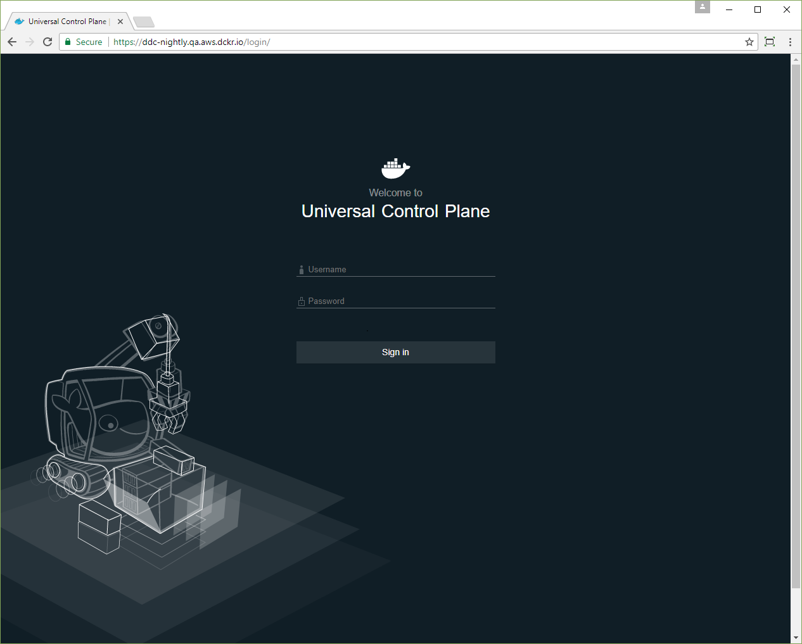
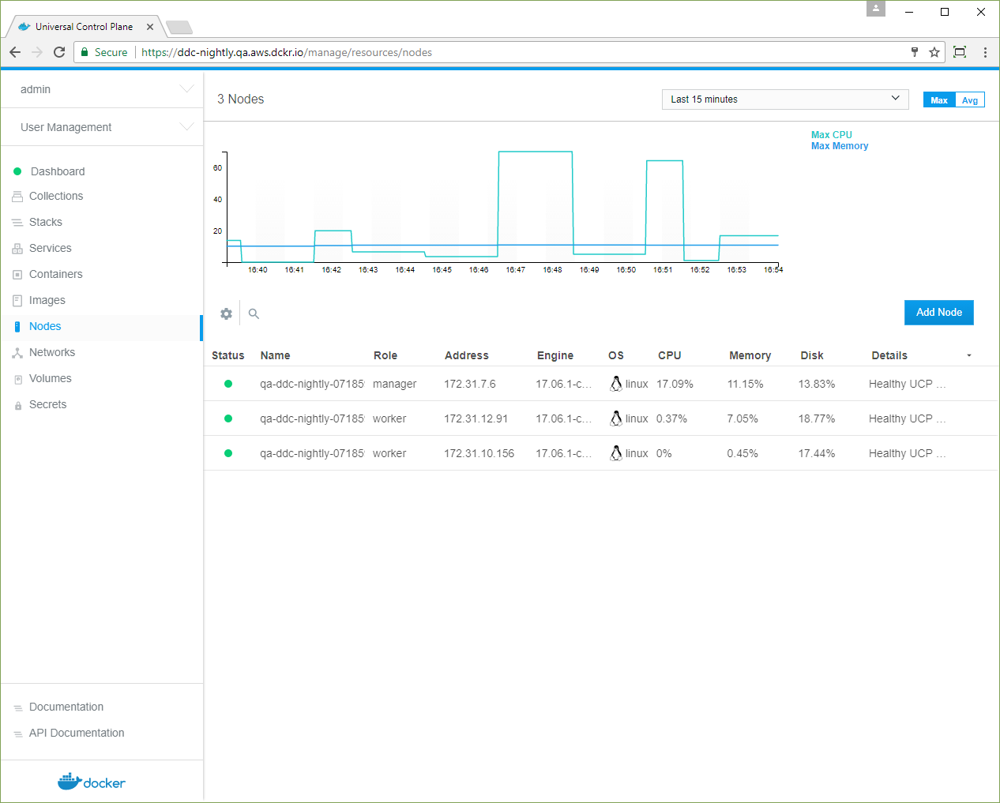
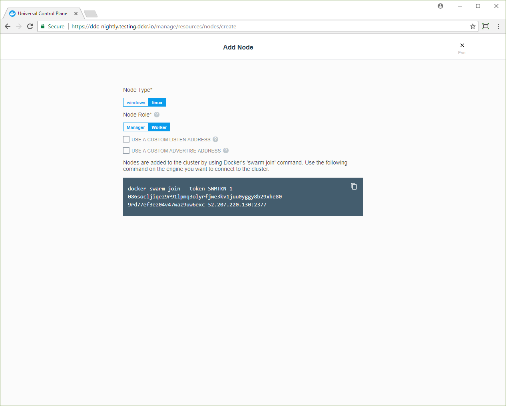

The best way to try Docker Enterprise Edition for yourself is to get the [30-day
trial available at the Docker Store](https://store.docker.com/search?offering=enterprise&type=edition).

Once you get your trial license, you can install Docker EE on your
Linux servers. Make sure all the hosts you want to manage with Docker
EE have a minimum of:

* [Docker Enterprise Edition](/engine/installation/index.md) version 17.06 or higher
* Linux kernel version 3.10 or higher
* 4.00 GB of RAM
* 3.00 GB of available disk space

Also, make sure the hosts are running one of these operating systems:

* A maintained version of CentOS 7. Archived versions aren't supported or tested.
* Red Hat Enterprise Linux 7.0, 7.1, 7.2, or 7.3
* Ubuntu 14.04 LTS or 16.04 LTS
* SUSE Linux Enterprise 12
* Oracle Linux 7.3

[Learn more about Docker EE system requirements](../ucp/2.2/guides/admin/install/system-requirements.md).

## Step 1: Install Docker EE Container Engine

Install the Docker Enterprise Edition container engine on all hosts you want
to manage by following [these instructions](/engine/installation/index.md).

## Step 2: Install Universal Control Plane

Docker Universal Control Plane (UCP) allows managing from a centralized place
your images, applications, networks, and other computing resources.

Use ssh to log in to the host where you want to install UCP and run:

```bash
$ docker container run --rm -it --name ucp \
  -v /var/run/docker.sock:/var/run/docker.sock \
  {{ page.ucp_latest_image }} install \
  --host-address <node-ip-address> \
  --interactive
```

This runs the install command in interactive mode, so that you're prompted
for any necessary configuration values.

[Learn more about the UCP installation](../ucp/2.2/guides/admin/install/index.md).

>**What about Windows?** When you have UCP installed, you can
[join Windows worker nodes to a swarm](/datacenter/ucp/2.2/guides/admin/configure/join-windows-worker-nodes/).

## Step 3: License your installation

Now that UCP is installed, you need to license it. In your browser, navigate
to the UCP web UI, log in with your administrator credentials and upload your
license.

{: .with-border}

[Get a free trial license if you don't have one](https://store.docker.com/editions/enterprise/docker-ee-trial).

## Step 4: Join more nodes to UCP

Join more nodes so that you can manage them from UCP.
Go to the UCP web UI and navigate to the **Nodes** page.

{: .with-border}

Click the **Add Node button** to add a new node.

{: .with-border}


Check **Add node as a manager** to join the node as a manager
to provide replication and make UCP highly available. For a highly available
installation, make sure you have 3, 5, or 7 manager nodes.

Copy the command to your clipboard, and run it on every node that you want
to be managed by UCP. After you run the command in the node, the node
will show up in the UP web UI.

## Step 5: Install Docker Trusted Registry

Docker Trusted Registry (DTR) is a private image registry so that you can
manage who has access to your Docker images. DTR needs to be installed on
a node that is being managed by UCP.

Use ssh to log in to the host where you already installed UCP, and run:

```bash
$ docker container run -it --rm \
  {{ page.dtr_latest_image }} install \
  --ucp-node <node-hostname> \
  --ucp-insecure-tls
```

Where the `--ucp-node` is the hostname of the UCP node where you want to deploy
DTR. `--ucp-insecure-tls` tells the installer to trust the certificates used
by UCP.

## Where to go next

* [Scale your UCP cluster](../ucp/2.2/guides/admin/configure/scale-your-cluster.md)
* [Deploy an application](../ucp/2.2/guides/user/services/index.md)
