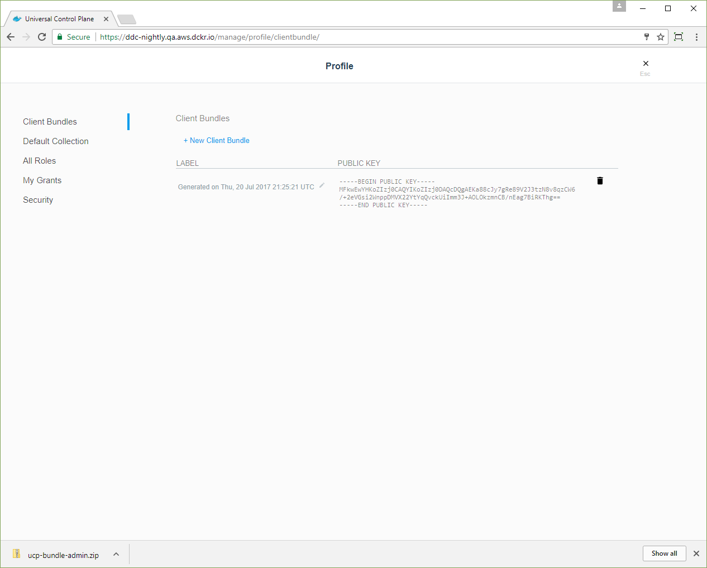

Docker UCP secures your swarm by using role-based access control,
so that only authorized users can perform changes to the cluster.

For this reason, when running docker commands on a UCP node, you need to
authenticate your request with client certificates. When trying to run docker
commands without a valid certificate, you get an authentication error:

```none
$ docker ps

x509: certificate signed by unknown authority
```

There are two different types of client certificates:

* Admin user certificate bundles: allow running docker commands on the
  Docker Engine of any node,
* User certificate bundles: only allow running docker commands through a UCP
  manager node.

## Download client certificates

To download a client certificate bundle, log in to the UCP web UI and
navigate to your **My Profile** page.

In the left pane, click **Client Bundles** and click **New Client Bundle**
to download the certificate bundle.

{: .with-border}

## Use client certificates

Once you've downloaded a client certificate bundle to your local computer, you
can use it to authenticate your requests.

Navigate to the directory where you downloaded the user bundle, and unzip it.
Then source the `env.sh` script.

```bash
$ unzip ucp-bundle-dave.lauper.zip
$ eval "$(<env.sh)"
```

The `env.sh` script updates the `DOCKER_HOST` environment variable to make your
local Docker CLI communicate with UCP. It also updates the `DOCKER_CERT_PATH`
environment variable to use the client certificates that are included in the
client bundle you downloaded.

> **Note**: The bundle includes scripts for setting up Windows nodes. To set up a
> Windows environment, run `env.cmd` in an elevated command prompt, or run
> `env.ps1` in an elevated PowerShell prompt.

To verify a client certificate bundle has been loaded and the client is
successfully communicating with UCP, look for `ucp` in the `Server Version`
returned by `docker version`.

```bash

$ docker version --format '{{.Server.Version}}'

{{ page.ucp_repo }}/{{ page.ucp_version }}
```

From now on, when you use the Docker CLI client, it includes your client
certificates as part of the request to the Docker Engine. You can now use the
Docker CLI to create services, networks, volumes, and other resources on a swarm
that's managed by UCP.

## Download client certificates by using the REST API

You can also download client bundles by using the
[UCP REST API](../../../reference/api/index.md). In this example,
we use `curl` to make the web requests to the API, and `jq` to parse the
responses.

To install these tools on a Ubuntu distribution, you can run:

```bash
$ sudo apt-get update && apt-get install curl jq
```

Then you get an authentication token from UCP, and use it to download the
client certificates.

```bash
# Create an environment variable with the user security token
$ AUTHTOKEN=$(curl -sk -d '{"username":"<username>","password":"<password>"}' https://<ucp-ip>/auth/login | jq -r .auth_token)

# Download the client certificate bundle
$ curl -k -H "Authorization: Bearer $AUTHTOKEN" https://<ucp-ip>/api/clientbundle -o bundle.zip
```

## Where to go next

* [Access the UCP web UI](index.md)
