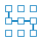



  

    <h2>
      Get started with Docker
    </h2>
    
    

      Try our new multi-part walkthrough that goes from writing your first app, data storage, networking, and swarms, ending with your app running on production servers in the cloud. Total reading time is less than an hour!
    

    
    

      <a href="/get-started/">Get started with Docker</a>{: class="button outline-btn"}
    

  

  
  

    <h2>
      Try Docker Enterprise Edition
    </h2>
    
    

      Run your solution in production with Docker Enterprise Edition and you'll get a management dashboard, security scanning, LDAP integration, content signing, multi-cloud support, and more. Click below to test drive a running instance of Docker EE, without installing anything.
    

    
    

      <a href="https://dockertrial.com">Try Docker Enterprise Edition</a>{: class="button outline-btn" onclick="ga('send', 'event', 'EE Trial Referral', 'Front Page', 'Click');"}
    

  

 

## Docker CE Edge

The Docker CE Edge channel provides monthly releases which allow you to try new features of Docker and verify bug fixes quickly. Edge releases are only supported for one month, and a given Edge release will not receive any updates once a new edge release is available.

Stable releases are not published to the Edge channel, so Linux repository users still need to subscribe to the Stable channel as well.

Commercial support is not available for Docker CE.

For information about all Docker release channels and expectations about support, see [Docker channels](/engine/installation/#docker-channels).

<!-- This button toggles the div below, and hides itself when clicked -->
<a id="ce-edge-readmore-btn" onclick="$(this).hide(); ga('send', 'event', 'ce-edge-readmore', 'click', 'CE engagement');" data-target="#ce-edge-readmore" data-toggle="collapse" class="button outline-btn collapse in">Read more about Docker CE Edge releases</a>

  

    This page lists features that are only available in Docker CE Edge releases. Where applicable, the API and CLI reference documentation has been updated to reflect these features, but <strong>full documentation for a given feature may not be available until a Docker CE Stable release incorporates the feature</strong>.
  

  
  <h3>
    Docker CE Edge new features
  </h3>

<ul class="nav nav-tabs">
  <li class="active"><a data-toggle="tab" data-target="#1704">17.04</a></li>
  <!--<li><a data-toggle="tab" data-target="#1705">17.05</a></li>-->
</ul>

  
  

    

      <h4>
        Docker CE Edge 17.04
      </h4>
      
      

        The following major features and changes are included in Docker CE Edge 17.04. Continue reading, or go straight to <a href="#api-and-cli">API and CLI</a>, <a href="#daemon">Daemon</a>, <a href="#dockerfile">Dockerfile</a>, <a href="#services">Services</a>, or <a href="#stacks">Stacks</a>.
      

      
      

        <a href="https://github.com/moby/moby/releases/tag/v17.04.0-ce">Read the full release notes</a>{: target="<em>blank" class="</em>" }
      

      
      <h5>
        API and CLI
      </h5>
      
      <ul>
        <li>
          

            Add <code>--device-cgroup-rule</code> flag to give containers access to devices that appear after the container is started. 
          

        </li>
        <li>
          

            Allow swarm nodes to join with <code>--availability=drain</code> to prevent them from taking non-manager workloads. 
          

        </li>
        <li>
          

            Add <code>publish</code> and <code>expose</code> filters to <code>docker ps</code>, so that containers can be filtered by port or port range for TCP or UDP protocols 
          

        </li>
        <li>
          

            Add <code>--no-trunc</code> and <code>--format</code> flags to the <code>docker service ls</code> command, and as well as the ability to specify the default format for <code>docker service ls</code> using the <code>ServicesFormat</code> option to the Docker CLI. Also add a <code>docker stack services</code> command. 
          

        </li>
        <li>
          

            Add ability to filter plugins by whether they are enabled or disabled in <code>docker plugin ls</code> output. 
          

        </li>
        <li>
          

            Add <code>mode</code> option to <code>--log-opts</code> flag for both <code>docker</code> and <code>dockerd</code>. If set to <code>non-blocking</code>, and the log buffer fills up, log messages will be lost, but the container will not block. The <code>max-buffer-size</code> option controls the maximum size of the ring buffer. Defaults to <code>blocking</code>, which will cause the container to block if messages cannot be logged. See <a href="/engine/admin/logging/overview.md#options-for-all-drivers">Options for all drivers</a>. 
          

        </li>
        <li>
          

            It is no longer possible to inadvertently pull images on an architecture where they will not run. 
          

        </li>
        <li>
          

            It is now possible to create AWS log groups when using the AWS logging driver. See <a href="engine/admin/logging/awslogs.md#awslogs-create-group"><code>awslogs-create-group</code></a>. 
          

        </li>
        <li>
          

            Add the ability to filter <code>docker network ls</code> output by creation time, using the <code>{{CreatedAt}}</code> format specifier. 
          

        </li>
        <li>
          

            Named but untagged images are now removed if you run <code>docker image prune</code> if <code>--dangling-only</code> is set to <code>true</code>. 
          

        </li>
        <li>
          

            Add <code>--add-host</code> flag to <code>docker build</code>, which will add entries to the <code>/etc/hosts</code> file of a container created from that image. The <code>/etc/hosts</code> file is not saved within the image itself. 
          

        </li>
        <li>
          

            Prevent <code>docker network ls</code> from pulling all the endpoints, to reduce impact on the network. 
          

        </li>
        <li>
          

            Windows-specific commands and options no longer show in command help text on non-Windows clients. 
          

        </li>
        <li>
          

            When you specify an IP address when running <code>docker network connect</code>, the IP address is now checked for validity. 
          

        </li>
        <li>
          

            Add the ability to customize bind-mount consistency to be more appropriate for some platforms and workloads. Options are <code>consistent</code> (the default), <code>cached</code>, or <code>delegated</code>. 
          

        </li>
      </ul>
      
      <h5>
        Daemon
      </h5>
      
      <ul>
        <li>
          

            Docker Daemon logging settings no longer affect the <code>docker build</code> command. 
          

        </li>
        <li>
          

            Add a <code>registry-mirrors</code> configuration option for the Docker daemon, which replaces the daemon's registry mirrors with a new set of registry mirrors. 
          

        </li>
        <li>
          

            Add the ability to specify the default shared memory size for the Docker daemon, using the <code>--default-shm-size</code> or the <code>default-shm-size</code> key in <code>daemon.json</code>. 
          

        </li>
        <li>
          

            Add a <code>no-new-privileges</code> configuration option for the Docker daemon, which prevents unprivileged containers from gaining new privileges. 
          

        </li>
        <li>
          

            If a Docker client communicates with an older daemon and attempts to perform an operation not supported by the daemon, an error is printed, which shows the API versions of both the client and daemon. 
          

        </li>
        <li>
          

            The Docker daemon no longer depends upon <code>sqlite</code>. This change means that it is not possible to upgrade the Docker daemon from version 1.9 directly to the latest version. It is recommended to upgrade from one major version to the next, in sequence. 
          

        </li>
      </ul>
      
      <h5>
        Dockerfile
      </h5>
      
      <ul>
        <li>
          

            Using the pattern <code>**/</code> in a Dockerfile now (correctly) behaves the same as <code>**</code>. 
          

        </li>
        <li>
          

            Time values less than 1 second are no longer allowed in health-check options in the Dockerfile. 
          

        </li>
      </ul>
      
      <h5>
        Services
      </h5>
      
      <ul>
        <li>
          

            When a service is updated with both <code>--secret-add</code> and <code>--secret-rm</code> in the same operation, the order of operations is now changed so that the <code>--secret-rm</code> always occurs first. 
          

        </li>
        <li>
          

            Add the ability to create or update a service to be read-only using the <code>--read-only</code> flag. 
          

        </li>
        <li>
          

            Docker now updates swarm nodes if the swarm configuration is updated. 
          

        </li>
        <li>
          

            Add topology-aware placement preferences for Swarm services. This feature allows services to be balanced over nodes based on a particular user-defined property, such as which datacenter or rack they are located in. See <a href="/engine/swarm/services.md#control-service-scale-and-placement">Control service scale and placement</a>. 
          

        </li>
        <li>
          

            Add the ability to customize the stop signal which will be sent to nodes, when creating or updating a service. 
          

        </li>
        <li>
          

            Add the ability to address a secret by name or prefix, as well as ID, when updating it. 
          

        </li>
        <li>
          

            Add the ability to roll back to a previous version of a service if an updated service fails to deploy. Several flags are available at service creation or update,to control the rollback action, failure threshold, monitoring delay, rollback delay, and parallelism. 
          

        </li>
        <li>
          

            Add the ability to specify the stream when using the Docker service logs API. 
          

        </li>
        <li>
          

            Add <code>--tail</code> and <code>--since</code> flags to <code>docker service logs</code> command, to filter the logs by time or to show the tail of the logs and show new content as it is logged. 
          

        </li>
        <li>
          

            Add a <code>--verbose</code> flag to the <code>docker inspect</code> command. For swarm networks, this flag shows all nodes and services attached to the network. 
          

        </li>
      </ul>
      
      <h5>
        Stacks
      </h5>
      
      <ul>
        <li>
          Compose file version 3.2 is now supported. This includes support for different types of endpoints and expands the options you can use when specifying mounts. 
        </li>
      </ul>
    

    
    

      <!-- 17.04 -->
      
      <!--
TAB 2 CONTENT
-->
    

  

  
  <!-- tab-content -->

<!-- ce-edge-readmore -->  

<!-- from line 13 --> {{ ce-edge-section | markdownify }} 

## Docker Editions

  

    <h3>
      Docker Community Edition
    </h3>
    
    

      Get started with Docker and experimenting with container-based apps. Docker CE is available on many platforms, from desktop to cloud to server. Build and share containers and automate the development pipeline from a single environment. Choose the Edge channel to get access to the latest features, or the Stable channel for more predictability.
    

    
    

      <a href="/engine/installation/#platform-support-matrix">Learn more about Docker CE</a>{: class="button outline-btn"}
    

  

  
  

    <h3>
      Docker Enterprise Edition
    </h3>
    
    

      Designed for enterprise development and IT teams who build, ship, and run business critical applications in production at scale. Integrated, certified, and supported to provide enterprises with the most secure container platform in the industry to modernize all applications. Docker EE Advanced comes with enterprise <a href="#docker-ee-add-ons">add-ons</a> like UCP and DTR.
    

    
    

      <a href="/engine/installation/#platform-support-matrix">Learn more about Docker EE</a>{: class="button outline-btn"}
    

  

<!-- end row -->

## Run Docker anywhere

    <!--start row-->
    

        

            

                

                    
                

                <h3 id="docker-for-mac"><a href="docker-for-mac/">Docker for Mac</a></h3>
                
A native application using the macOS sandbox security model which delivers all Docker tools to your Mac.

            

        

        

            

                

                    
                

                <h3 id="docker-for-windows"><a href="docker-for-windows/">Docker for Windows</a></h3>
                
A native Windows application which delivers all Docker tools to your Windows computer.

            

        

        

            

                

                    
                

                <h3 id="docker-for-linux"><a href="engine/installation/linux/ubuntu/">Docker for Linux</a></h3>
                
Install Docker on a computer which already has a Linux distribution installed.

            

        

    

    <!--start row-->
    

        

            

                

                    
                

                <h3 id="docker-cloud"><a href="docker-cloud/">Docker Cloud</a></h3>
                
A hosted service for building, testing, and deploying Docker images to your hosts.

            

        

        

            

                

                    
                

                <h3 id="docker-cloud-providers"><a href="docker-for-aws/">Docker for AWS</a></h3>
                
Deploy your Docker apps on AWS.

            

        

        

            

                

                    
                

                <h3 id="docker-cloud-providers"><a href="docker-for-azure/">Docker for Azure</a></h3>
                
Deploy your Docker apps on Azure.

            

        

    

## Components

<h5>Docker EE Add-ons</h5>

    <!--start row-->
    

    <!--UCP-->
        

            

                

                    
                

                <h3 id="ucp"><a href="datacenter/ucp/2.2/guides/">Universal Control Plane</a></h3>
                
(UCP) Manage a cluster of on-premise Docker hosts like a single machine with this enterprise product.

            

        

    <!--DTR-->
        

            

                

                    
                

                <h3 id="dtr"><a href="datacenter/dtr/2.3/guides/">Docker Trusted Registry</a></h3>
                
(DTR) An enterprise image storage solution you can install behind a firewall to manage images and access.

            

        

    

    <!-- end real row-->

<h5>Docker Tools</h5>

    <!--start row-->
    

    <!--compose-->
        

            

                

                    
                

                <h3 id="compose"><a href="compose/overview/">Docker Compose</a></h3>
                
Define application stacks built using multiple containers, services, and swarm configurations.

            

        

    <!--machine-->
        

            

                

                    
                

                <h3 id="machine"><a href="machine/overview/">Docker Machine</a></h3>
                
Automate container provisioning on your network or in the cloud. Available for Windows, macOS, or Linux.

        

    

<!-- end component-container 2-->
